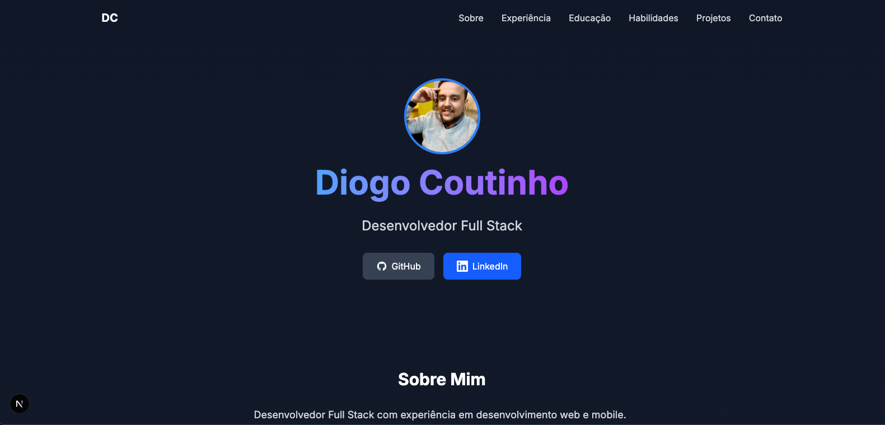

# Diogo Coutinho - Portfólio Pessoal



Um portfólio moderno e responsivo desenvolvido com Next.js, TypeScript e Tailwind CSS. Este projeto apresenta minha trajetória profissional, habilidades, projetos e informações de contato.

## 🚀 Tecnologias Utilizadas

- **Framework**: [Next.js](https://nextjs.org/) - Framework React para produção
- **Linguagem**: [TypeScript](https://www.typescriptlang.org/) - Superset tipado de JavaScript
- **Estilização**: [Tailwind CSS](https://tailwindcss.com/) - Framework CSS utilitário
- **Deploy**: [GitHub Pages](https://pages.github.com/) - Hospedagem estática
- **Ícones**: [Heroicons](https://heroicons.com/) - Biblioteca de ícones
- **Animações**: [Framer Motion](https://www.framer.com/motion/) - Biblioteca de animações

## ✨ Funcionalidades

- Design moderno e responsivo
- Seções organizadas:
  - Sobre Mim
  - Experiência Profissional
  - Educação
  - Habilidades (categorizadas)
  - Projetos
  - Contato
- Animações suaves
- Modo escuro
- Links para redes sociais
- Formulário de contato

## 🛠️ Instalação

1. Clone o repositório:

```bash
git clone https://github.com/diogocoutinho/diogocoutinho.github.io.git
cd diogocoutinho.github.io
```

2. Instale as dependências:

```bash
npm install
# ou
yarn install
```

3. Execute o projeto em desenvolvimento:

```bash
npm run dev
# ou
yarn dev
```

4. Acesse [http://localhost:3000](http://localhost:3000)

## 📁 Estrutura do Projeto

```
src/
├── app/                  # Páginas da aplicação
├── components/          # Componentes reutilizáveis
│   ├── ui/             # Componentes de UI
│   ├── Navbar.tsx      # Barra de navegação
│   ├── ProjectCard.tsx # Card de projeto
│   └── ...
├── public/             # Arquivos estáticos
└── styles/            # Estilos globais
```

## 🎨 Personalização

Para personalizar o portfólio:

1. Atualize as informações em `src/app/page.tsx`
2. Modifique as cores no arquivo `tailwind.config.js`
3. Adicione suas próprias imagens na pasta `public`
4. Atualize os projetos em `src/app/page.tsx`

## 📄 Licença

Este projeto está sob a licença MIT. Veja o arquivo [LICENSE](LICENSE) para mais detalhes.

## 🤝 Contribuições

Contribuições são bem-vindas! Sinta-se à vontade para abrir issues ou enviar pull requests.

## 📞 Contato

- GitHub: [@diogocoutinho](https://github.com/diogocoutinho)
- LinkedIn: [Diogo Coutinho](https://linkedin.com/in/diogoccoutinho)
- Email: [diogo.coutinho.ads@gmail.com](mailto:diogo.coutinho.ads@gmail.com)
